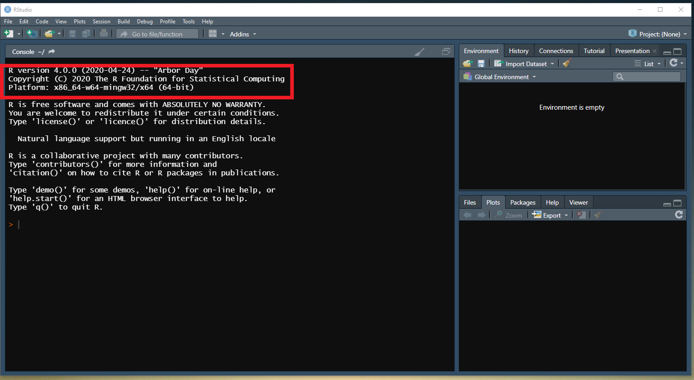
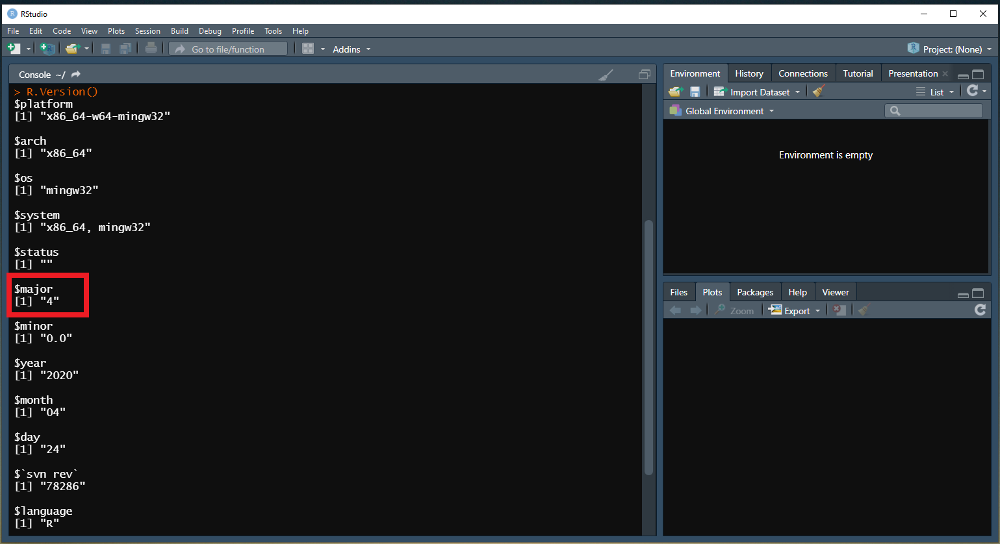

**Author**: Max Tschol 
**Date**: 18 May 2021

Hello fellow Hacker,

this short guide shows you how to contribute to the Reprothon 2021.
The aim of the Reprothon is to test whether the accepted answers to questions on StackOverflow are reproducible or not, and enter the result into a spreadsheet.

Check out the general data generating process below.

## Data generating process

**1. Obtain Question ID from "Question_ID_Generator" (name needed)**

**2. Visit StackOverflow and try to reproduce in R**

**3. Fill out Google Form "Reprothon2021_data_entry"**  

## 4 quick steps how you can contribute 

**1. Sign up for Reprothon event**  
Sign up to the Reprothon by following this link https://docs.google.com/forms/d/e/1FAIpQLScnZ58LT9lgCHWgHK0JFD-1CPEOyZPcWdCM3VBxDdnXDgQ_AA/viewform

**2. Check your email for your personal ReprothonID**  
Every participant needs an individual ID that you will get sent to you after you have signed up. You will need to enter the ID into the Google form later.

**3. Check your email for the link to the Question_ID_Generator and the Google Form "Reprothon2021_data_entry**  
Once you have signed up, we will also send you an email that contains a link to the QuestionIDGenerator. Follow the link and press enter to obtain a new Question to reproduce. The email will also contain a link to the Google Form Reprothon2021_data_entry that you please fill out for every question you answer. Examples on how to fill out the form can be found in the tutorial links at the bottom of this page.

**4. Check your R Version before you start**  
Before you start reproducing examples on StackOverflow, please check if you have R Version 4 installed.
If you use RStudio, your R Version should show up when you start RStudio.

Otherwise use the R.Version function to check

> R.Version()

In case you have an earlier Version than 4, follow this link to update your Rversion https://uvastatlab.github.io/phdplus/installR.html 

## Check out tutorials  
See this tutorial for a basic data entry example.(Link)  
See this tutorial that deals with common problems arising when replicating StackOverflow questions. (Link)

